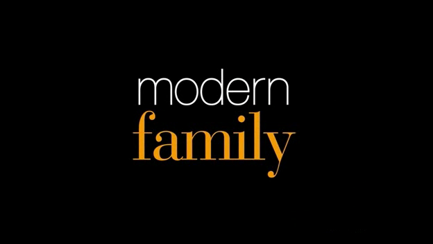

```{r setup, include=FALSE}
knitr::opts_chunk$set(echo = TRUE)
```

## Description

Modern Family is an American mockumentary family sitcom television series created by *Christopher Lloyd* and *Steven Levitan* for the American Broadcasting Company. It ran for eleven seasons, from September 23, 2009, to April 8, 2020. It follows the lives of three diverse family set-ups in suburban Los Angeles, linked by patriarch *Jay Pritchett*.

## Logo



## Views Plot

```{r views, echo=FALSE}
a <- seq(1,11,1)
b <- c(9.49,11.89,12.93,12.31,11.79,11.91,9.83,8.79,7.09,6.4,7.1)

df <- data.frame(a,b)
colnames(df) <- c("Season","Views (M)")
plot(df)
```
```{r view-change, echo=FALSE}
diff = 12.93-11.89

```

Between season 2 and 3 total viewership increased by `r 12.93-11.89` views.